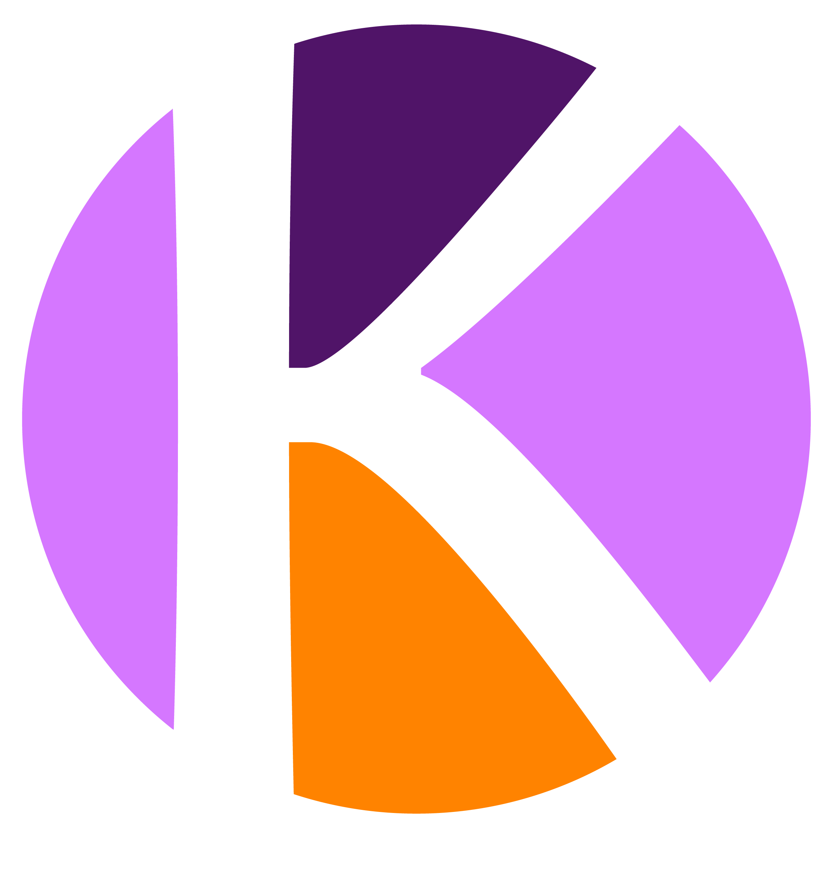

 

    
   <h1 align="center">Kodetica</h1>
    

Una organización hispanohablante de programadores, sin fines de lucro,
que tiene como fin dar conocimientos sobre la programación en general.

<!-- TODO: documentar funcionamiento acá para los redactores
> y el funcionamiento interno del tema para los interesados
> en contribuir con la página. -->

## :spiral_notepad: Licencia

La web de Kodetica, incluyendo Kode (su tema de Hugo) están
bajo la [licencia MIT](./LICENSE).
